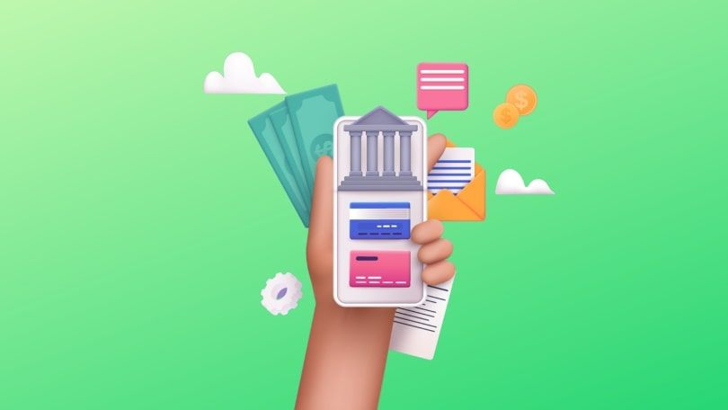

# ✨ Casos de Uso


**¿Tienes una idea que no está acá?** ¡Mándanos un correo a [contacto@koywe.com](mailto:contacto@koywe.com)!


¿Sabías que el uso del dinero es anterior a la invención de la escritura? Lo podemos deducir porque los primeros escritos hablan de... ¡dinero! No exactamente el dinero como lo imaginamos hoy, pero dinero al fin y al cabo. Entonces el dinero es fundamentalmente humano, no podemos concebir la realidad sin él. ¡Hoy estamos viviendo un cambio en los paradigmas del dinero y creemos que las blockchains jugarán un rol muy importante en este proceso!

En Koywe queremos ser las tuberías y cables que potencien modelos de creación de valor, habilitados por las blockchains. Acá algunos ejemplos.

## ¿Nuevo en Cripto? No hay problema

Muy pocas personas tienen wallets propias o han interactuado directamente con contratos inteligentes o protocolos de [DeFi](https://es.wikipedia.org/wiki/Finanzas\_descentralizadas). Esto constituye una gran barrera para que proyectos cripto ganen adopción y tracción, especialmente en Latinoamérica.

Con las APIs y Widgets de Koywe los proyectos cripto pueden ofrecer sus servicios a cualquier persona en Latinoamérica, sin que ellas tengan que estar en cripto desde antes. Tus usuarios fácilmente podrán interactuar con tus protocolos o contratos, sin que necesariamente se den cuenta que hay cripto por debajo.

Tokeniza activos reales, vende NFTs de arte o de conservación de la naturaleza, ofrece herramientas de compensación de emisiones de carbono, cuentas de inversión, o protocolos de [sueldo básico universal](https://es.wikipedia.org/wiki/Renta\_b%C3%A1sica\_universal), ¡en moneda local!

Koywe se encarga de transformar esos pesos o soles en ETH o USDC para que tú sigas enfocado en construir tu proyecto web3.

## Clientes en toda Latinoamérica

¿Vendes productos o servicios en Latinoamérica? ¿Has soñado con vender en más países que el tuyo?

Con Koywe te ayudamos a llegar rápido, sin tener que preocuparte de abrir sociedades o cuentas bancarias en otros países. Tus clientes pagan en moneda local, a los precios más convenientes, y nosotros nos encargamos que tu recibas los fondos donde quieras.

## El backend de las Fintechs

¿Cuentas para tus clientes en dólares con rendimientos? ¿Transferencias entre países a bajo costo? ¿Clientes con KYC alrededor de Latam?

Te ayudamos a explorar las opciones que tienen las blockchain para lograr esto de manera escalable y a precios razonables, de la forma más fácil para ti y tus clientes.

Te podemos ayudar a recaudar y transferir, hacer KYC y AML cumpliendo con las reglas locales, y crecer tu fintech de la forma más simple posible.

<figure><figcaption></figcaption></figure>
