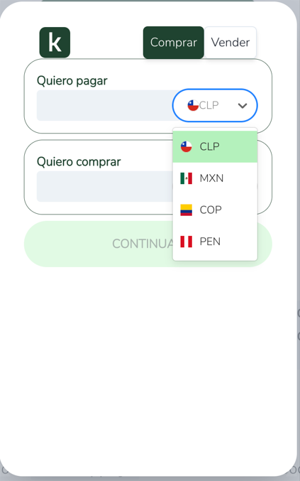
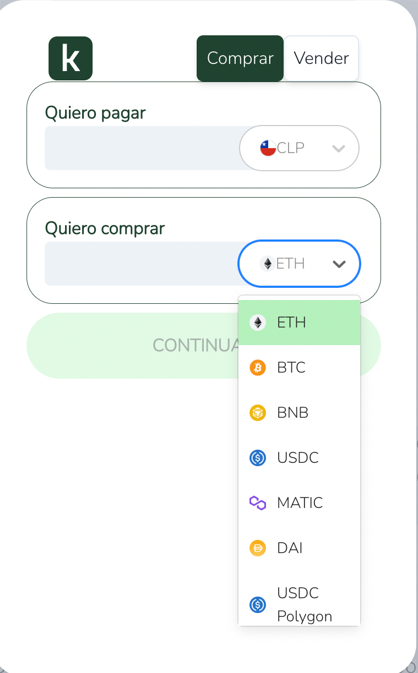

# 📥 Proceso de Compra


Si aún no has visto el video demo (de menos de 2 minutos), puedes verlo al final de esta página o en la sección principal de [_¿Qué es Koywe?_](./)__


## 1. Selecciona la moneda con que quieres pagar y la criptomoneda que quieres recibir

<figure><figcaption></figcaption></figure>

 

<figure><figcaption></figcaption></figure>

El primer paso es seleccionar las monedas que quieres cambiar. En este ejemplo, elegiremos pagar con pesos chilenos (CLP) y recibir Ether en la red de Ethereum (ETH).


**Importante**: La moneda que elijas en este punto determinará la validación de identidad que tienes que hacer más adelante. De acuerdo a la regulación de cada país, puede que te pidamos más (o menos) datos.


## 2. Selecciona un monto a pagar o recibir

En este paso podrás seleccionar el monto a pagar en la moneda seleccionada o el monto a recibir en criptomonedas.

Si seleccionas un monto en moneda local, por ejemplo 100.000 CLP, nuestra API calculará cuantos tokens recibirás, descontando las comisiones.

Si seleccionas un monto en cripto, nuestra API calculará cuanto debes pagar, sumando las comisiones, para recibir esa cantidad de tokens.


En todo momento del flujo podrás ver exactamente cuánto estás pagando y cuánto recibirás, así como el detalle de las comisiones al hacer click en _**Ver Detalle**_.


## 3. Ingresa la Dirección de tu Billetera Cripto

El siguiente paso es ingresar la dirección de tu billetera cripto. Nuestra interfaz validará que sea un dirección válida, de acuerdo a la blockchain del token que seleccionaste.


Puedes ingresar un nombre de dominio ENS, en redes compatibles con ethereum, o conectar la wallet de tu navegador, para no tener que escribir la dirección a mano.


## 4. Valida tu identidad.

Puedes ver los pasos en la sección "Validación de usuario".

## 5. Confirmación de Compra y Medio de Pago

¡El último paso! En este paso encontrarás un resumen de tu orden y las opciones de pago disponibles. Selecciona la que más te acomode y sigue las instrucciones del medio de pago.


Recuerda: Si seleccionas transferencia bancaria, debes ir a tu banco a realizar el depósito con los datos que aparezcan en la interfaz y enviarnos un email de comprobante.


Nuestro sistema cambiará las comisiones de acuerdo al medio de pago que selecciones.

No olvides aceptar los Términos y Condiciones y nuestra Política de Privacidad.

## 6. \[Opcional] Seguimiento de tu Transacción

Una vez confirmado el pago, no necesitas hacer nada más. ¡En unos minutos recibirás tus cripto! Podrás hacer seguimiento de la orden, a la que podrás llegar desde el menú en la derecha.


Una vez que la transacción se envíe al blockchain, podrás hacerle seguimiento con tu explorador de bloques favorito.


