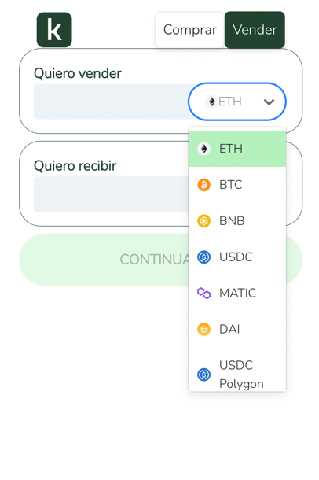
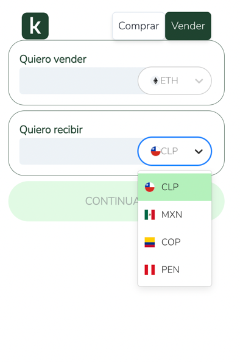
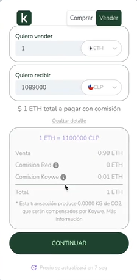
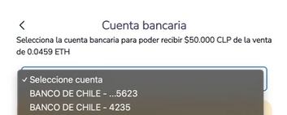
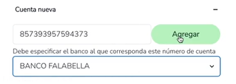
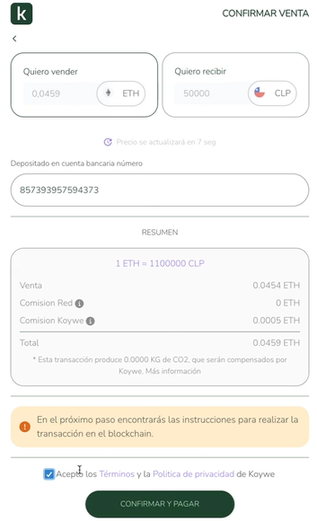
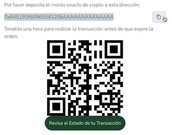
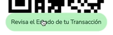

# 📤 Proceso de Venta


¡Nuestros servicios API de Off ramp ya están disponibles! Visita la documentación de nuestras APIs para más información.


¡Ahora podrás usar Koywe para vender tus cryptos de la forma más fácil! Los pasos para usar el Widget son muy simples:

## 1. Ingresa la moneda que quieres vender, y la moneda que quieres recibir.

<figure><figcaption></figcaption></figure>

 

<figure><figcaption></figcaption></figure>

## 2. Ingresa el monto que quieres vender, o el que quieres recibir.

<figure><figcaption></figcaption></figure>


En todo momento del flujo podrás ver exactamente cuánto estás pagando y cuánto recibirás, así como el detalle de las comisiones al hacer click en _**Ver Detalle**_.


<figure><figcaption></figcaption></figure>

## 3. Valida tu identidad.

Puedes ver los pasos en la sección "[Validación de usuario](validacion-de-usuario.md)".

## 4. Selecciona la cuenta bancaria a la que quieres que enviemos el monto.

<figure><figcaption></figcaption></figure>

 

<figure><figcaption></figcaption></figure>

Puedes seleccionar una existente o añadir una nueva.

<figure><figcaption></figcaption></figure>

## 5. Procede con el pago.

Asegurate de revisar los detalles de comisión y no olvides aceptar los términos y condiciones de Koywe.

<figure><figcaption></figcaption></figure>

Envía tus cryptos al address que te enviamos. Puedes copiar la dirección o escanear el código qr.

<figure><figcaption></figcaption></figure>

## 6. Revisa el estado de tu transacción.

Para revisar el estado de tu transacción, puedes hacerlo con el botón que va a aperecer abajo del código qr.

<figure><figcaption></figcaption></figure>

<figure><figcaption></figcaption></figure>

